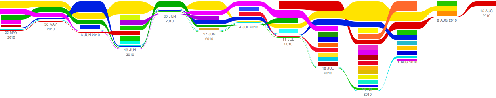

!SLIDE center

!SLIDE
# Taking Mongoid into the Future

!SLIDE bullets
# Bernerd Schaefer #

* @bjschaefer
* github.com/bernerdschaefer
* oinopa.com
* 

!SLIDE bullets
* Rails 3
* MongoDB

!SLIDE center
# Happy Birthday, Mongoid!

!SLIDE bullets incremental

# It's growing, baby!
* 88 contributors
* 40 in the last 2 months, with over 300 commits!
  

!SLIDE bullets incremental
# Compare with another Mongo library...
* 

!SLIDE bullets incremental

# It's a community
* Solid documentation http://mongoid.org
* Active IRC (#mongoid)
* Mailing List http://groups.google.com/group/mongoid

!SLIDE
# It's global!

!SLIDE
# Mongoid  Rails 3

!SLIDE
# Railties

!SLIDE

    @@@ Bash
    rails new my_app -m http://mongoid.org/rails.rb

!SLIDE

    @@@ Bash
    rails g model user name:string age:integer data:hash

!SLIDE code

    @@@ Ruby
    class User
      include Mongoid::Document
      field :name, :type => String
      field :age, :type => Integer
      field :data, :type => Hash
    end

!SLIDE
# ActiveModel

!SLIDE bullets
# Validations

!SLIDE code

    @@@ Ruby
    class User
      validates_presence_of :name
      validates_numericality_of :balance
    end

!SLIDE
# Serialization

!SLIDE code

    @@@ Ruby
    user.to_json
    # => {"name":"John","_id":"4c77d0e5f7e2da6800000003"}
    user.to_xml(:include => :posts)
    # => <user>...</user>

!SLIDE
# Mass Assignment

!SLIDE code

    @@@ Ruby
    class User
      attr_accessible :name
      attr_protected  :age
    end

    user.age # => 20
    user.update_attributes(:age => 3)
    user.age # => 20

!SLIDE bullets incremental
# But Still Agnostic...

* Sinatra
* Padrino

!SLIDE code

    @@@ Ruby
    class User
      include DataMapper::Resource
    end

    class Comments < ActiveRecord::Base
    end

    class Post
      include Mongoid::Document
      referenced_in :user
      references_many :comments
    end

!SLIDE
# Mongoid  MongoDB

!SLIDE
## github.com/mongoid/mongoid/issues

!SLIDE bullets incremental
# Core Mongo Features

* Fast In-Place Updates
* Rich Document Based Querying
* Replication and High Availability

!SLIDE
# In-Place Updates

!SLIDE code

    @@@ Ruby
    Person.embeds_many :addresses
    Address.embeds_many :locations

!SLIDE code

    @@@ Ruby
    person.attributes
    # => {"_id" => 1,
    #     "addresses" => [
    #       {"_id" => 1,
    #        "locations" => [
    #         {"_id" => 1},
    #         {"_id" => 2}
    #        ]}]}

!SLIDE code

    @@@ Ruby
    person.addresses[0].locations[0].update_attributes(
      :name => "Chicago"
    )

!SLIDE bullets
# Other Mongo Libraries
* Push full document graph

!SLIDE code

    @@@ Javascript
    db.users.update({_id: ""}, {
      addresses: [
        { locations: [{name: "Chicago"}] },
        { locations: [{name: "Dallas"}] }
      ]
    })

!SLIDE
# But Mongoid embraces the "Mongo Way"

!SLIDE code

    @@@ Javascript
    db.users.update(
      {_id : 1, 'addresses._id' : 2 },
      {
      "$pushAll" => {
        'addresses.$.addresses': [{name: "Chicago"}]
      }
    )

!SLIDE
# Rich Query Language

!SLIDE code

    @@@ Ruby
    User.where(:name => "John")
    User.all(:age.lt => 24, :age.gt => 18)
    User.where(:title.in => %w(Ms Mrs))

!SLIDE code

    @@@ Ruby
    Person.where("addresses.locations.name" => "Chicago")

!SLIDE code

    @@@ Ruby
    class User
      scope :active, :status => 'active'
      scope :over, :lambda { |age| where(:age.gt => age) }
    end

    User.where(:name => /^J/).active.over(40)

!SLIDE
# Geospatial Indexes

!SLIDE code

    @@@ Ruby
    class Spot
      include Mongoid::Document

      field :name, :type => String
      field :latlng, :type => Array

      index [[:latlng, Mongo::GEO2D]]
    end

!SLIDE code
    @@@ Ruby
    Spot.create(
      :name => "Old Town Ale House",
      :latlng => [41.910973,-87.635544]
    )

!SLIDE
# So what can we do with this?

!SLIDE code

    @@@ Ruby
    Spot.where(:latlng.near => alehouse.latlng)
      # => ["Old Town Pizza Pub", "Second City", ...]

!SLIDE code

    @@@ Ruby
    Spot.where(
      :latlng.within => {
        "$center" => [alehouse.latlng, 0.01]
      }
    ).excludes(:_id => alehouse.id)
    # => ["Second City", "Trattoria Roma"]

!SLIDE
# Okay, but let's clean that up...

!SLIDE code

    @@@ Ruby
    class Spot
      scope :close_to, lambda { |l|
        where(:_id.ne => l.id,
              :latlng.within => {
                "$center" => [l.latlng, 0.01]
              }) }
    end

    Spot.close_to(alehouse).limit(1)
    # => ["Second City"]

!SLIDE
# Replication and High Availability

!SLIDE
# Replication in Mongoid 1.4: Master / Slave

!SLIDE
# Master

!SLIDE
# Slaves

!SLIDE

    @@@ Bash
    mongod --master --dbpath /data/master
    mongod --slave  --source 127.0.0.1:27017 \
      --dbpath /data/slave1
    mongod --slave  --source 127.0.0.1:27017 \
      --dbpath /data/slave2

!SLIDE bullets incremental

* Write to master
* At some point, writes are synced to slaves
* Required for durability

!SLIDE code

    @@@ Yaml
    master:
      uri: mongodb://127.0.0.1:27017

!SLIDE code

    @@@ Ruby
    User.create # writes to master

!SLIDE
# If we need the slaves... why not use them?

!SLIDE code

    @@@ Yaml
    master:
      uri: mongodb://127.0.0.1:27017
    slaves:
      - uri: mongodb://127.0.0.1:27018
      - uri: mongodb://127.0.0.1:27019

!SLIDE code

    @@@ Ruby
    User.all # reads from master
    User.enslave.all # round-robin reads from slaves

!SLIDE
# Works fine...

!SLIDE bullets incremental
# Except not enough control

* No guarantees for syncing
* No automatic failover

!SLIDE code

    @@@ Ruby
    slave = Mongo::Connection.new(
      nil,
      27018,
      :slave_ok => true
    )
    User.create
    slave["users"].count # 0
    sleep 2
    slave["users"].count # 1

!SLIDE
# Master goes down...

    kill <pid_of_master>

!SLIDE
# Must restart a slave as the new master
    kill <pid_of_slave1>
    mongod --master --dbpath /data/slave1

!SLIDE
# Solution?

!SLIDE
# Replica Sets
### new in Mongo 1.6

!SLIDE

    @@@ Bash
    mongod --replSet myset --port 27017 --dbpath /data/r0
    mongod --replSet myset --port 27018 --dbpath /data/r1
    mongod --replSet myset --port 27019 --dbpath /data/r2

!SLIDE

    @@@ Yaml
    master:
      uri: mongodb://127.0.0.1:27017
    slaves:
      - uri: mongodb://127.0.0.1:27018
      - uri: mongodb://127.0.0.1:27019

!SLIDE code

    @@@ Ruby
    User.all # reads from master
    User.enslave.all # round-robin reads from slaves

!SLIDE
# All about control

!SLIDE
# Guarantees for Syncing

!SLIDE code

    @@@ Ruby
    User.safely(:fsync => true).create
    # ensures data is written to disk before returning

!SLIDE code

    @@@ Ruby
    User.safely(:w => 2).create
    # returns after data is written to 2 of the 3 servers

!SLIDE code

    @@@ Ruby
    User.safely(:w => 2, :wtimeout => 3000).create
    # returns with an error if operation takes
    # over 3000 milliseconds

!SLIDE code

    @@@ Ruby
    user.safely(:w => 1).update_attributes(...)
    user.safely.destroy
    User.safely.destroy_all(...)

!SLIDE
# Automatic Failover

!SLIDE

    kill <pid_of_master>

!SLIDE code

    @@@ Ruby
    User.create # Mongo::ConnectionFailure
    sleep 2
    User.create # success!

!SLIDE
# And much more, because...

!SLIDE
# If you can do it with Mongo, you can do it with Mongoid.

!SLIDE bullets incremental
# So what's next?

* RC RSN.

!SLIDE bullets incremental
# Whatever happens in mongo 1.7.x, and 1.8, and..

* Virtual collections for embedded documents
* Real date support
* Capped arrays for Mongoid::Versioning

!SLIDE bullets
# Thanks for listening!

* Slides are available here:  `http://github.com/bernerdschaefer/mongoidslides`

* Mongoid Site:  `http://mongoid.org`

* Mongoid Source:  `http://github.com/mongoid/mongoid`

!SLIDE bullets

# Questions?
